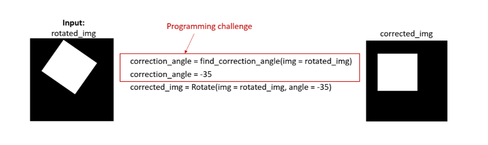
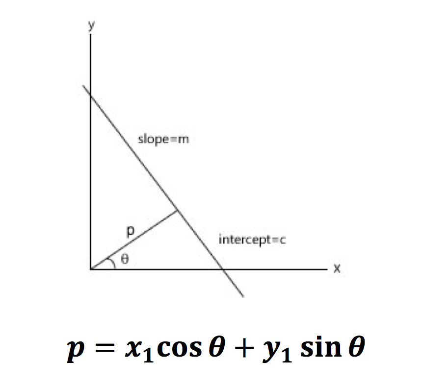
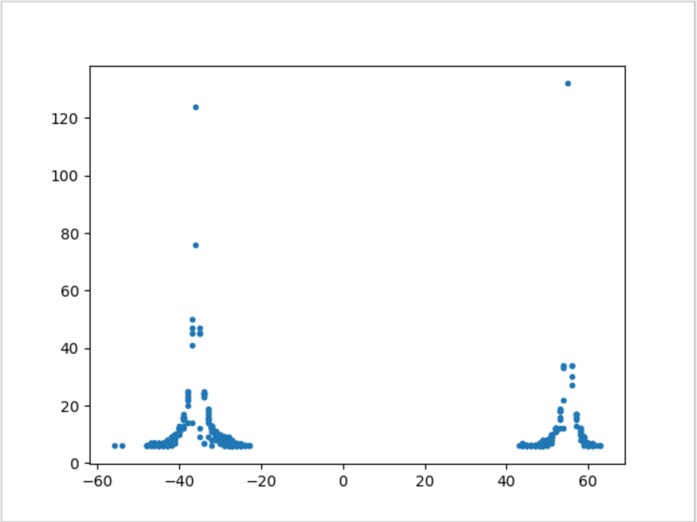
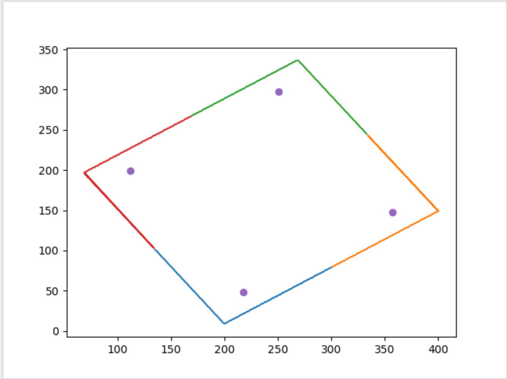

# Rectangle Detection in a Binary Image

Implemented a function that accepts a binary image of a rectangular sample and returns a correction angle, that if applied to the original image, would return a ‘righted’ image, as shown in the below image:

<p align="center">
  
</p>  

Two methods are used to calculate the correction angle of the rectangle in the image: 

1.	Hough Transform Algorithm
2.	K-Means Clustering Algorithm

The accuracy is high in Hough Transform method as we are considering all the possible lines passing through each data point. In K-Means clustering method, using 4 clusters the rectangle data gives 4 centroid points which form a rectangle with edges parallel to the edges of the original triangle.


## Hough Transform Algorithm
**Step 1:** Data refining: extracted the edge points of the rectangle from the csv file.</br></br>
**Step 2:** For every point, distance p is calculated from origin to every (p, theta) line (normal form) that passes through the point. The range of theta will be -90 to 90.</br></br>
 
<p align="center">
  
</p>  

**Step 3:** For every such line, number of contributing data points in the data set are counted and stored in accumulator array, with (p, theta) as indices.</br></br>
**Step 4:** From the array, the top two (p, theta) lines with maximum data points gives us the four edges of the rectangle. Hence, the two corresponding theta values are the correction angles.</br></br>


## K-Means Clustering Algorithm
K-means clustering is an optimization algorithm to find K clusters in the given set of data points. </br>
**Step 1:** Data refining: extracted the edge points of the rectangle from the csv file. </br></br>
**Step 2:** K-Means clustering algorithm is applied for the refined dataset, to segregate the rectangle data points into 4 clusters. </br></br>
**Step 3:** In K-Means algorithm, initially 4 centres are randomly chosen from data set and each data point is assigned to its nearest centre. After this, until convergence, the centres are moved to the mean of the data points in its cluster. </br></br>
**Step 4:** K-Means algorithm will result 4 centres and the data points in its cluster. The 4 centres form parallel lines to the rectangle edges. Hence, using these points correction angle is calculated. </br></br>

## Getting Started:
**Step 1:**  Change the directory to the src folder
```
cd RectangleDetection/src
```
**Step 2:**  Run UsingKMeans.py file and UsingHoughTransform.py
```
python UsingKMeans.py
```
```
python UsingHoughTransform.py
```

## Output:

<p align="center">
  
  <em>Fig1. Theta vs No. of data points</em>
</p>  
</br></br>
<p align="center">
  
  <em>Fig2. Plot of data points in 4 clusters and their centroids</em>
</p>
 
## Prerequisites
Python version 3.6.4, numpy and matplotlib 
